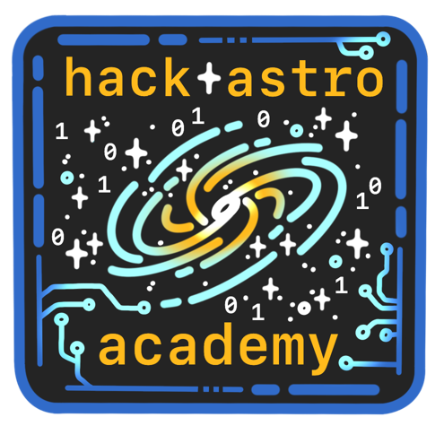

  

------------------------------------------------------------------------
|  |  |
|:---|:---|
| **Facilitators:** | Oscar Chavez (<chavezoscar009@utexas.edu>) |
|  | Owen Chase (<owen.chase@utexas.edu>) |
| **Time & Place:** | Tuesday/Thursday 5PM - 6PM in 15th Floor Computer Lab (PMA 15.201) |
| **Office Hours:** | By appointment |

------------------------------------------------------------------------

# Course Description

This course aims to provide students with an introduction to the command
line and the Python programming language. Primary emphasis will be
placed on data analysis skills related to astronomy and physics in
preparation for upper-division courses and research. Advanced skills
such as image manipulation and machine learning techniques will also be
explored.

The course is targeted to students with little-to-no prior programming
experience. Consequently, the instruction will begin with the very
basics and work up to more advanced topics. We encourage students with
prior experience to come and go as they see fit to practice or acquire
new skills.

# Learning Objectives

Students will be introduced to basic programming concepts with the goal
of becoming comfortable and proficient in using Python and bash in
research settings. The primary learning goals of the course include:

-   Navigating the computer using the command line and performing basic
    operations on files and directories

-   Installing and managing software and packages

-   Understanding how to write and run programs using good development
    habits

-   Using Numpy, AstroPy and other packages to process and manipulate
    data

-   Visualizing using Matplotlib

-   Using Git and GitHub for version control and collaboration

-   Understanding the differences and advantages of different
    programming languages

-   Learning to debug faulty code

Additional topics may be explored given enough time and interest.
Examples of such topics include:

-   Machine learning

-   High performance computing (using supercomputers at the Texas
    Advanced Computing Center)

-   Compiled programming

# Expectations and Work Load

We have designed this course to give students the skills they need to
participate in research. We are unable to offer course credit or
guarantee research lab placement after completion of the course. As
such, we expect no formal commitment from students to attend or complete
work. We will not have graded assignments nor other formal evaluations.
However, we believe that learning software development requires more
practice than we can provide in the few short hours per week we will
meet. We will therefore offer projects and activities for students to
work on at home to practice their skills. We will also be available to
help students individually as needed. All together, we expect that a
student who attends and completes all offered course work will spend ∼
5 hours per week.

# Course Resources

Course materials can be found on
[GitHub](https://github.com/ochase10/HackAstro-Academy). We will use
Slack as our primary means of communication. Slack is a place to ask questions and
receive answers from both the course instructors and your peers. We
encourage you to use Slack rather than email, as it allows us to provide
more expedient responses and may benefit classmates with similar
questions.

# Schedule

Below is a schedule of class meetings for Fall 2025 along with a (tentative)
curriculum.

| Week | Mon | Wed | Topics|
|:---:|:----:|:-----:|-------------|
| 1 | 9/2 | 9/4 | <ul><li>Syllabus overview and logistics</li><li>Installing Python</li><li>Intro to bash</li></ul>|
| 2 | 9/9 | 9/11 | <ul><li>Hello, World</li><li>Thinking like a programmer</li><li>Text editors</li></ul>|      
| 3 | 9/16 | 9/18 | <ul><li>Control Flow</li><li>Data Types</li></ul>   
| 4 | 9/23 | 9/25 | <ul><li>Control Flow (cont.)</li><li>Review</li></ul> 
| 5 | 9/30 | 10/2 | <ul><li>Functions</li><li>File I/O</li></ul>  
| 6 | 10/7 | 10/9 | <ul><li>Packages</li><li>Numpy</li></ul>  
| 7 | 10/14 | 10/16 | <ul><li>Numpy</li><li>Matplotlib</li></ul>
| 8 | 10/21 | 10/23 | <ul><li>Astropy</li><li>FITs files</li></ul>
| 9 | 10/28 | 10/30 | <ul><li>Pandas</li><li>Data Science</li></ul>
| 10 | 10/4 | 10/6 | <ul><li>Model Fitting</li><li>MCMC</li></ul>
| 11 | 10/11 | 10/13 | <ul><li>Projects</li><li>Advanced Topics</li></ul>
| 12 | 10/18 | 10/20 | <ul><li>Projects</li><li>Advanced Topics</li></ul>
| 13 | 12/2 | 12/4 |  <ul><li>Projects</li><li>Advanced Topics</li></ul>
| 14 | 12/9 | 12/11 | <ul><li>Projcts</li><li>Advanced Topics</li></ul>
